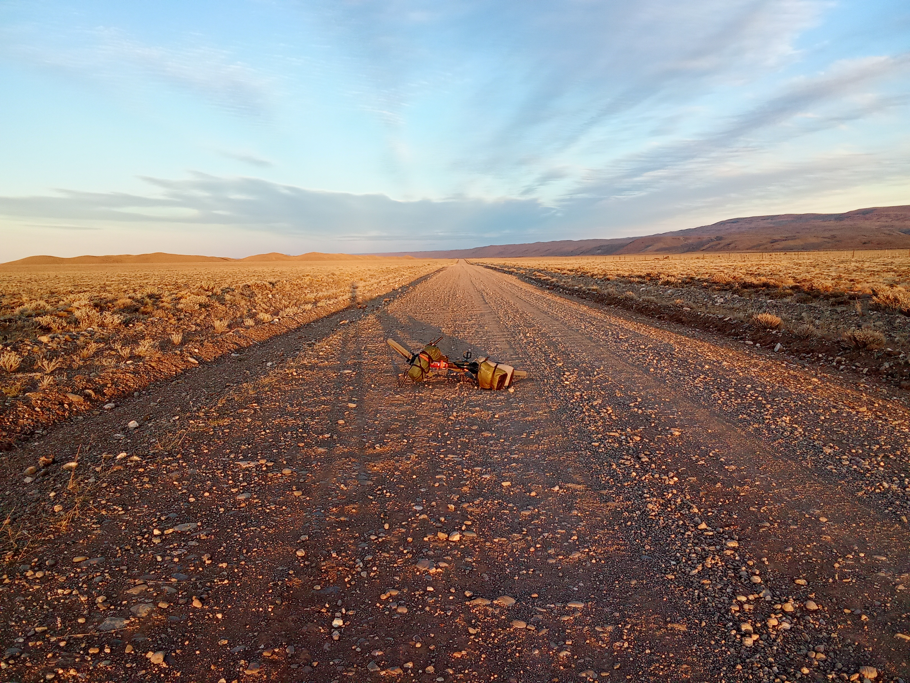

# 🚵‍♂️ My Bikepacking Expeditions
> "Exploring the world's physics on two wheels."

### 🏔️ Patagonia: The Great Horizon
The Andes taught me about the scale of systems. Navigating the border between Chile and Argentina with just a bicycle and a map.

#### **1. [Episode I: The Silent Horizon (Chile)](/bikepacking/patagonia-chile/)**
* 파타고니아의 시작, 칠레의 험준한 산악 지형을 돌파하며 마주한 첫 번째 지평선.
* [여행기 읽기 →](/bikepacking/patagonia-chile/)

#### **2. [Episode II: The Andean Crossing](/bikepacking/patagonia-crossing/)**
* 칠레와 아르헨티나 국경을 넘나드는 모험. 비포장도로(Gravel) 위에서의 사투.
* [여행기 읽기 →](/bikepacking/patagonia-crossing/)

#### **3. [Episode III: The Winds of Argentina](/bikepacking/patagonia-argentina/)**
* 아르헨티나의 강력한 바람을 뚫고 나아간 여정의 피날레. 샤오미 Redmi A30의 레전드 샷 탄생지.
* [여행기 읽기 →](/bikepacking/patagonia-argentina/)
  

  
  
<i>"The endless horizon of Patagonia."</i>

---

### 🌅 Colorado Trail: 13,271 ft Sunrise
Thru-riding the rugged CT. This is where I learned that persistence is the most important variable in any model.

  
  
<i>"Sunrise at the highest point of the Colorado Trail (4,045m)."</i>

